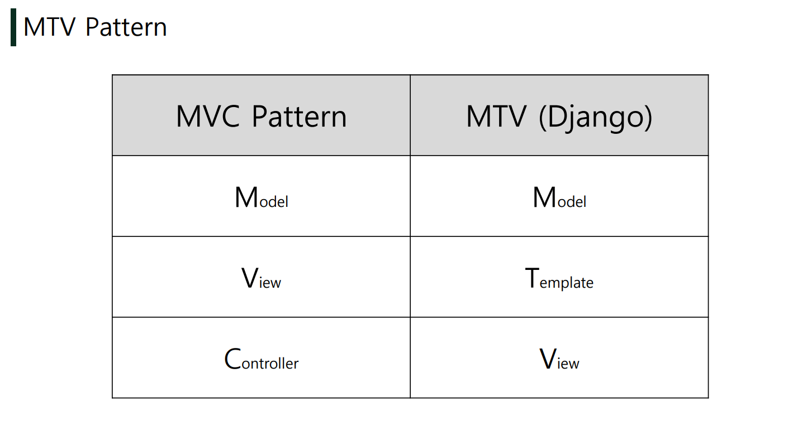
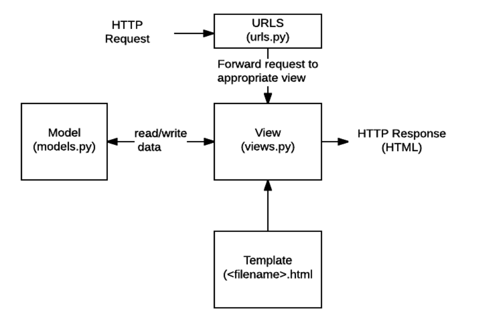

# Django 란? 

--------


> #  Django
>
> * dDjango is a highlevel Python Web framework that encourages rapid development and clean, pragmatic design
> * it takes care of much of the hassle of Web development, so you can focus on writing your app withour nedding to reinvent the wheel
>
> > ### 1. Web Framework
> >
> > >1. Framework
> > >
> > >* 프로그래밍에서 특정 운영 체제를 위한 응용 프로그램 표준 구조를 구현하는 클래스와 라이브러리 모임
> > >* 재사용할 수 있는 수많은 코드를 프레임워크로 통합함으로써 개발자가 새로운 애플리케이션을 위한 표준 코드를 다시 작성하지 않아도 같이 사용할 수 있도록 도움
> > >* Application Framework 라고도 함
> > >* __웹 페이지를 개발하는 과정에서 겪는 어려움을 줄이는 것이 주 목적__으로 데이터베이스 연동, 템플릿 형태의 표준, 세션 관리, 코드 재사용 등의 기능을  포함
> > >* 동적인 웹 페이지나, 웹 애플리케이션, 웹 서비스 개발 보조용으로 만들어지는 Application Framework의 일종
> > >
> > >2. Framework Architecture
> > >
> > >   * MVC Design Pattern (model-view-controller)
> > >   * 소프트웨어 공학에서 사용되는 디자인 패턴 중 하나
> > >   * 사용자 인터페이스로부터 프로그램 로직을 분리하여 애플리케이션의 시각적 요소나 이면에서 실행되는 부분을 서로 영향 없이 쉽게 고칠 수 있는 애플리케이션을 만들 수 있음
> > >   * Django는 MTV Pattern이라고 함
> > >
> > >3. MTV  Pattern
> > >
> > >   1. Model
> > >
> > >      * 응용프로그램의 데이터 구조를 정의하고 데이터베이스의 기록을 관리(추가, 수정, 삭제)
> > >
> > >   2. Template
> > >
> > >      * 파일의 구조나 레이아웃을 정의
> > >      * 실제 내용을 보여주는 데 사용(presentation)
> > >
> > >   3. Views
> > >
> > >      * HTTP 요청을 수신하고 HTTP 응답을 반환
> > >      * Model을 통해 요청을 충족시키는데 필요한 데이터에 접근
> > >      * template에게 응답의 서식 설정을 맡김
> > >
> > >      
> > >
> > >
> > >
> > >3. Django를 위한 사전 준비 사항
> > >
> > >   ```python
> > >   # django 설치 (최신 버전)
> > >   pip install django
> > >   
> > >   # 현재 환경에 설치된 패키지 목록 확인
> > >   pip list
> > >   
> > >   # 프로젝트 생성
> > >   django-admin startproject config.
> > >   
> > >   # django 서버 실행
> > >   python manage.py runserver
> > >   ```
> > >
> > >   * ```__init__.py``` : Python에게 이 디렉토리를 하나의 Python 패키지로 다루도록 지시
> > >   * ```asgi.py``` : Asynchronous Server Gateway Interface , django 애플리케이션이 비동기식 웹 서버와 연결 및 소통하는 것을 도움
> > >   * ```settings.py``` : 애플리케이션의 모든 설정을 포함
> > >   * ```urls.py``` : 사이트의 url과 적절한 views의 연결을 지정 
> > >   * ```wsgi.py``` : Web Server Gateway Interface, django 애플리케이션이 웹 서버와 연결 및 소통하는 것을 도움
> > >   * ```manage.py```: Django 프로젝트와 다양한 방법으로 상호작용 하는 커맨드라인 유틸리티 
> > >
> > >   ```
> > >   python manage.py startapp articles
> > >   ```
> > >
> > >   * ```admin.py``` : 관리자용 페이지를 설정 하는 곳 
> > >   * ```apps.py``` : 앱의 정보가 작성된 곳
> > >   * ```models.py``` :  앱에서 사용하는 Model을 정의하는 곳
> > >   * ```tests.py``` : 프로젝트의 테스트 코드를 작성하는 곳
> > >   * ```views.py``` : view 함수들이 정의 되는 곳 
> > >
> > >4. Project & Application
> > >
> > >   * Project
> > >     * Project(이하 프로젝트)는 Application(이하 앱)의 집합 (collection of apps)
> > >     * 프로젝트에는 여러 앱이 포함될 수 있음
> > >     * 앱은 여러 프로젝트에 있을 수 있음
> > >   * Application
> > >     * 앱은 실제 요청을 처리하고 페이지를 보여주고 하는 등의 역할을 담당
> > >     * 하나의 프로젝트는 여러 앱을 가짐
> > >     * 일반적으로 앱은 하나의 역할 및 기능 단위로 작성
> > >
> > >5. 앱 등록
> > >
> > >   * 프로젝트에서 앱을 사용하기 위해서는 반드시 ```settings.py```의 INSTALLED_APPS 리스트에 추가해야 한다
> > >   * INSTALLED_APPS : Django installation에 활성화 된 모든 앱을 지정하는 문자열 목록 
> > >   * 반드시! 생성 후! 등록!
> > >
> > >6. URLS
> > >
> > >   * HTTP 요청(request)을 알맞은 view로 전달 
> > >   * HTTP 요청을 수신하고 HTTP 응답을 반환하는 함수 작성
> > >   * Model을 통해 요청에 맞는 필요 데이터에 접근
> > >   * Template에게 HTTP 응답 서식을 맡김 
> > >
> > >7. Templates
> > >
> > >   * 실제 내용을 보여주는데 사용되는 파일 
> > >   * 파일의 구조나 레이아웃을 정의
> > >   * Template 파일 경로의 기본 값은 __app 폴더 안의 templates 폴더__로 지정되어 있음.
> > >
> > >8. LANGUAGE_CODE
> > >
> > >   * 모든 사용자에게 제공되는 번역을 결정
> > >   * 이 설정이 적용 되려면 USE_I18N이 활성화되어 있어야 함
> > >
> > >9. TIME_ZONE
> > >
> > >   * 데이터베이스 연결의 시간대를 나타내는 문자열 지정
> > >   * USE_TZ가 True이고 이 옵션이 설정된 경우 데이터베이스에서 날짜 시간을 읽으면, UTC 대신 새로 설정한 시간대의 인식 날짜&시간이 반환 됨
> > >   * USE_TZ이 False인 상태로 이 값을 설정하는 것은 error가 발생하므로 주의
> > >   * USE_I18N : Django의 번역 시스템을  활성화해야 하는지 여부를 지정
> > >   * USE_L10N : 데이터 지역화 된 형식 (localized formatting)을 기본적으로 활성화할지 여부를 지정, True일 경우, Django는 현재 locale의 형식을 사용하여 숫자와 날짜를 표시
> > >
> > >   * USE_TZ : datetimes가 기본적으로 시간대를 인식하는지 여부를 지정, True일 경우 Django는 내부적으로 시간대 인식 날짜 / 시간을 사용
> > >
> > > 10. Static web page (정적 웹 페이지)
> > >
> > >   * 서버에 미리 저장된 파일이 사용자에게 그대로 전달되는 웹 페이지
> > >   * 서버가 정적 웹 페이지에 대한 요청을 받은 경우 서버는 추가적인 처리 과정 없이 클라이언트에게 응답을 보냄
> > >    * 모든 상황에서 모든 사용자에게 동일한 정보를 표시
> > >    * 일반적으로 HTML, CSS, JavaScript 로 작성됨
> > >    * flat page 라고도 함
> > > 
> > > 11. Dynamic web page (동적 웹 페이지)
> > >
> > >   * 웹 페이지에 대한 요청을 받은 경우 서버는 추가적인 처리 과정 이후 클라이언트에게 응답을 보냄
> > >   * 동적 페이지는 방문자와 상호작용하기 때문에 페이지 내용은 그때그때 다름 
> > >    * 서버 사이드 프로그래밍 언어(python, java, c++ 등)가 사용되며 파일을 처리하고 데이터베이스와의 상호작용이 이루어짐
> > > 
> > > 12. Django Template
> > >
> > >   * 데이터 표현을 제어하는 도구이자 표현에 관련된 로직
> > >   * 사용하는 built-in system : Django template languate
> > > 
> > > 13. Django Template Language (DTL)
> > >
> > >   * django template에서 사용하는 buit-in template system
> > >   * 조건, 반복, 변수 치환, 필터 등의 기능을 제공
> > >    * 단순히 Python이 HTML에 포함 된 것이 아니며, 프로그래밍적 로직이 아니라 프리젠테이션을 표현하기 위한 것
> > >    * Python처럼 일부 프로그래밍 구조 (if, for 등)를 사용할 수 있지만, 이것은 해당 python 코드로 실행되는 것이 아님 
> > > 
> > > 14. DTL Syntax
> > >
> > >   1. Variable
> > >
> > >       * render()를 사용하여 views.py에서 정의한 변수를 template 파일로 넘겨 사용하는 것
> > >      * 변수명은 영어, 숫자와 밑줄(_)의 조합으로 구성될 수 있으나 밑줄로는 시작 할 수 없음
> > >         * 공백이나 구두점 문자 또한 사용할 수 없음
> > >       * dot(.)를 사용하여 변수 속성에 접근할 수 있음
> > >       * render()의 세번째 인자로 { 'key' : value}  와 같이 딕셔너리 형태로 넘겨주며, 여기서 정의한 key에 해당하는 문자열이 template에서 사용 가능한 변수명이 됨
> > > 
> > >    2. Filters
> > >
> > >       * {{ variable|filter }}
> > >      * 표시할 변수를 수정할 때 사용
> > >       * 일부 인자는 인자를 받기도 함
> > >       * {{ name | lower }}  name 변수를 모두 소문자로 출력
> > > 
> > >    3. Tags
> > >
> > >       * { % tag %}
> > >
> > >       * 출력 텍스트를 만들거나, 반복 또는 논리를 수행하여 제어 프름을 만드는 등 변수보다 복잡한 일들을 수행
> > >
> > >       * 일부 태그는 시작과 종료 태그가 필요
> > >
> > >         ```
> > >         # 반복돌며 해당 인수에 한번씩 접근, 모든 인수 사용시 처음으로 돌아간다 
> > >           <tr class="">
> > >               ...
> > >           </tr>
> > >         
> > >         ```
> > > 
> > >         ```
> > >         # 파이썬 for과 같고, reversed 통해 역순 조회 가능
> > >         <li>{{ athlete.name }}</li>
> > >          # 비었으면 출력
> > >         <li>Sorry, no athletes in this list.</li>
> > >         
> > >         ```
> > > 
> > >         ```
> > >        
> > >         This appears of varialbe somvevar equals the string  "X"
> > >         
> > >         ```
> > > 
> > >         ```
> > >         # 주어진 뷰와 매개변수가 일치하는 절대 경로를 반환 
> > >         # /clients/client/123/
> > >         path('client/<int:id>/', app_views.client, name='app-views-client')
> > >         path('clients/', include('project_name.app_name.urls'))
> > >         
> > >         # 네임 스페이스로 할 경우
> > >         
> > >         ```
> > > 
> > > 
> > >
> > >            4. Comments
> > >
> > >       ```
> > >      {# #} : 한줄 주석
> > > 
> > >        : 여러줄 주석 
> > >             ...
> > >       
> > >       ```
> > > 
> > > 15. __코드 작성 순서__
> > >
> > >   1. urls.py
> > >   2. views.py
> > >    3. templates
> > > 
> > > 16. Template ingeritance (탬플릿 상속)
> > >
> > >   * 템플릿 상속은 기본적으로 코드의 재사용성에 초점을 맞춤
> > >
> > >    * 템플릿 상속을 사용하면 사이트의 모든 공통 요소를 포함하고, 하위 템플릿이 재정의(override) 할 수 있는 블록을 정의하는
> > >
> > >      기본 "skeleton" 템플릿을 만들 수 있음 
> > >
> > >      ```
> > >      #템플릿 확장, 반드시 템플릿 최상단에 작성
> > >       # 하위 템플릿에서 재지정(overriden)할 수 있는 블록을 정의 
> > >      
> > >      
> > >      ```
> > > 
> > > 17. Django template system (feat. django 설계 철학)
> > >
> > >   * 표현과 로직(view)을 분리
> > >     * 템플릿 시스템은 표현을 제어하는 도구이자 표현에 관련된 로직일 뿐이라고 생각한다.
> > >      * 즉, 템플릿 시스템은 이러한 기본 목표를 넘어서는 기능을 지원하지 말아야 한다.
> > >    * 중복을 배제
> > >      * 대다수의 동적 웹사이트는 공통 headere, footer, navbar 같은 사이트 공통 디자인을 갖는다.
> > >      * Django 템플릿 시스템은 이러한 요소를 한 곳에 저장하기 쉽게 하여 중복 코드를 없애야 한다.
> > >      * 이것이 템플릿 상속의 기초가 되는 철학이다. 
> > > 
> > > 18. HTML 'form' element
> > >
> > >   * 웹에서 사용자 정보를 입력하는 여러 방식(text, button, checkbox, file, hidden, image, password, radio, reset, submit)을 제공하고,
> > >
> > >      사용자로부터 할당된 데이터를 서버로 전송하는 역할을 담당 
> > >
> > >    * 핵심 속성
> > >
> > >      * action : 입력 데이터가 전송될 URL 지정
> > >     * method : 입력 데이터 전달 방식 지정
> > > 
> > > 19. HTML 'input' element
> > >
> > >   * 사용자로부터 데이터를 입력 받기 위해 사용
> > >   * type 속성에 따라 동작 방식이 달라짐
> > >    * 핵심 속성
> > >      * __name__
> > >      * 중복 가능, 양식을 제출했을 때 name이라는 이름에 설정된 값을 넘겨서 값을 가져올 수 있음
> > >      * 주요 용도는 GET/POST 방식으로 서버에 전달하는 파라미터(name은 key, value는 value)로 
> > > 
> > > 20. HTML 'label' element
> > >
> > >   * 사용자 인터페이스 항목에 대한 설명(caption)을 나타냄
> > >
> > >    * label을 input 요소와 연결하기
> > >
> > >      * input에 id 속성 부여
> > >     * label에는 input의 id와 동일한 값의 for 속성이 필요
> > > 
> > >    * label과 iniput 요소 연결의 주요 이점
> > >
> > >      * 시각적인 기능 뿐만 아니라 화면 리더기에서 label을 읽어서 사용자가 입력해야 하는 텍스트가 무엇인지 더 쉽게 이해할 수 있도록
> > >
> > >        돕는 프로그래밍적 이점도 있음
> > >
> > >      * label을 클릭해서 input에 초점(focus)를 맞추거나 활성화(activate) 시킬 수 있음
> > >
> > > 21. HTML 'for' attribute
> > >
> > >   * for 속성의 값과 일치하는 id를 가진 문서의 첫 번째 요소를 제어
> > >     * 연결 된 요소가 labelable elements인 경우 이 요소에 대한 labeled control이 됨
> > >    * labelable elements
> > >      * label 요소와 연결할 수 있는 요소
> > >      * button, input(not hidden type), select, textarea
> > > 
> > > 22. HTML 'id' attribute
> > >
> > >   * 전체 문서에서 고유(must unique)해야 하는 식별자를 정의
> > >   * 사용 목적
> > >      * linking, scripting, styling 시 요소를 식별
> > > 
> > > 23. HTTP
> > >
> > >   * HyperText Transfer Protocol
> > >   * 웹에서 이루어지는 모든 데이터 교환의 기초
> > >    * 주어진 리소스가 수행 할 원하는 작업을 나타내는 request methods를 정의
> > >    * HTTP request method 종류
> > >      * GET, POST, PUT, DELETE
> > > 
> > > 24. HTTP request method - "GET
> > >
> > >   * 서버로부터 정보를 조회하는 데 사용
> > >   * 데이터를 가져올 때만 사용해아 함
> > >    * 데이터를 서버로 전송할 때 body가 아닌 Query String Parameters를 통해 전송
> > >    * 우리는 서버에 요청을 하면 HTML 문서 파일 한 장을 받는데, 이때 사용하는 요청의 방식이 GET
> > > 
> > > 25. URL
> > >
> > >   * Django URLs
> > >     * Dispatcher(발송자, 운항 관리자)로서의 URL
> > >      * 웹 에플리케이션은 URL을 통한 클라이언트의 요청에서부터 시작 됨 
> > > 
> > > 26. Variable Routing
> > >
> > >   * URL 주소를 변수로 사용하는 것
> > >   * URL의 일부를 변수로 지정하여 view 함수의 인자로 넘길 수 있음
> > >    * 즉, 변수 값에 따라 하나의 path()에 여러 페이지를 연결 시킬 수 있음 
> > > 
> > > 27. URL Path converters
> > >
> > >   * str
> > >     * '/'를 제외하고 비어 있지 않은 모든 문자열과 매치
> > >      * 작성하지 않을 경우 기본 값
> > >    * int
> > >      * 0 또는 양의 정수와 매치
> > >    * slug
> > >      * ASCII 문자 또는 숫자, 하이픈 및 밑줄 문자로 구성된 모든 문자열과 매치
> > > 
> > > 28. App URL mapping
> > >
> > >   * app의 view 함수가 많아지면서 사용하는 path() 또한 많아지고,
> > >
> > >      app 또한 더 많이 작성되기 때문에 프로젝트의 urls.py에서 모두 관리하는 것은 프로젝트 유지보수에 좋지 않음
> > >
> > >      따라서 각 app에 urls.py를 작성하게 됨
> > >
> > > 29. Including othere URLconfs
> > >
> > >   * urlpattern은 언제든지 다른 URLconf 모듈을 포함(include)할 수 있음
> > >   * include()
> > >      * 다른 URLconf들을 참조할 수 있도록 도움
> > >      * 함수 include()를 만나게 되면, URL의 그 시점까지 일치하는 부분을 잘라내고, 남은 문자열 부분을 후속 처리를 위해 include된 URLconf로 전달
> > > 
> > > 30. Naming URL patterns
> > >
> > >   * 이제는 링크에 url을 직접 작성하는 것이 아니라 path() 함수의 name 인자를 정의해서 사용
> > >   * Django Tempalte Tag 중 하나인 url 태그를 사용해서 path() 함수에 작성한 name를 사용할 수 있음
> > > 
> > > 31. url template tag
> > >
> > >   * 주어진 URL 패턴 이름 및 선택적 매개 변수와 일치하는 절대 경로 주소를 반환
> > >   * 템플릿에 URL을 하드 코딩하지 않고도 DRY 원칙을 위반하지 않으면서 링크를 출력하는 방법
> > > 
> > > 32. namespace (이름공간)
> > >
> > >   * 이름공간 또는 네임스페이스는 객체를 구분할 수 있는 범위를 나타내는 말로 일반적으로 하나의 이름 공간에서는 하나의 이름이 단 하나의 객체만을 가리키게 된다.
> > >     * 서로 다른 app의 같은 이름을 가진 url name은 이름공간을 설정해서 구분
> > >      * templates, static 등 django는 정해진 경로 하나로 모아서 보기 때문에 
> > > 
> > >    ```
> > >   app_name = 'articles'
> > >    urlpatterns = [
> > >    	path('admin/', admin,stie,urls),
> > >    	path('index/', views. index, name='index')
> > >    ]
> > >    ```
> > > 
> > > 33. Template namespace
> > >
> > >   * Django는 기본적으로 app_name/templates/ 경로에 있는 templates 파일들만 찾을 수 있으며, INSTALLED_APPS에 작성한 app 순서로 tamplates을 검색 후 랜더링 함
> > >   * 그래서 임의로 templates의 폴더 구조를 app_name/templates/app_name 형태로 변경 
> > > 
> > > 
> > 
> > ### 2. Django Model 
> >
> > >1. Model
> >>
> > >* 단일한 데이터에 대한 정보를 가짐
> > > * 사용자가 저장하는 데이터들의 필수적인 필드들과 동작들을 포함
> > >* 저장된 데이터베이스의 구조(layout)
> > >* django는 model을 통해 데이터에 접속하고 관리
> > >* 일반적으로 각각의 model은 하나의 데이터베이스 테이블에 매핑 됨
> > >* 웹 애플리케이션의 데이터를 구조화하고 조작하기 위한 도구
> > >
> > >2. 데이터베이스(DB)
> > >
> > >* 체계화된 데이터의 모임
> > >
> > >3. 쿼리(Query)
> > >
> > >* 데이터를 조회하기 위한 명령어
> > >* 조건에 맞는 데이터를 추출하거나 조작하는 명령어
> > >* "Query를 날린다." -> DB를 조작한다
> > >
> > >4. 스키마(Schema)
> > >
> > >* 데이터베이스에게 자료의 구조, 표현방법, 관계 등을 정의한 구조 (structure)
> > >* 데이터베이스의 구조와 제약 조건(자료의 구조, 표현 방법, 관계)에 관련한 전반적인 명세를 기술한 것
> > >
> > >5. 테이블(Table)
> > >
> > >* 열(column) : `필드(field)` or `속성`, 고유한 데이터 형식이 지정
> > >* 행(row) : `레코드(record)` or 튜플`, `테이블`의 데이터 행에 저장
> > >* 열(컬럼/필드)와 행(레코드/값)의 모델을 사용해 조직된 데이터 요소들의 집합. SQL 데이터베이스에서는 테이블을 관계 라고도 한다.
> > >* PK(기본키) : 각 행(레코드)의 고유값으로 Primary Key로 불린다. 반드시 설정하여야하며, DB 관리 및 관계 설정시 주요하게 활용
> > >
> > >6. ORM
> > >
> > >* Object-Relational-Mapping
> > >* 객체 지향 프로그래밍 언어를 사용하여 호환되지 않는 유형의 시스템 간에(Django - SQL)데이터를 변환하는 프로그래밍 기술
> > >* OOP 프로그래밍에서 RDBMS을 연동할 때, DB와 객체지향 프로그래밍 언어 간의 호환되지 않는 데이터를 변환하는 프로그래밍 기법
> > >* Django는 내장 Django ORM을 사용함
> > >* SQL statement와 Python Object를 서로 변환한다 생각하면 된다. 
> > >* 장점
> > >  * SQL을 잘 알지 못해도 DB 조작이 가능
> > >  * SQL의 절차적 접근이 아닌 객체 지향적 접근으로 인한 높은 생산성
> > >* 단점
> > >  * ORM 만으로 완전한 서비스를 구현하기 어려운 경우가 있음
> > >* 현대 웹 프레임워크의 요점은 웹 개발의 속도를 높이는 것. (생산성)
> > >* 즉, DB를 객체(Object)로 조작하기 위해 ORM을 사용
> > >
> > >7. models.py 작성
> > >
> > >```python
> > >class Article(models.Model): # django.db 라는 모듈의 models를 상속
> > >    # 모델의 필드 
> > >    # 각 속성은 각 데이터베이스의 열에 매핑
> > >    title = models.CharField(max_length = 10) # 길이 제한 문자열 넣을때 사용, max_length는 필수 인자
> > >    										  # 필드의 최대 길이(문자), 데이터베이스 레벨과 Django의 유효성 검사 활용
> > >    content = models.TextField() 			  # 글자 수 많을 때 사용
> > >    										  # max_length 사용시 자동 양식 필드인 textarea에는 반영, 모델과 DB수준에는 적용 안됨
> > >        									  # 즉, max_length는 CharField에서 사용
> > >    created_at = models.DataTimeField(auto_now_add=True) # 최초 생성일자
> > >    													 # django ORM이 최초 insert(테이블에 데이터 입력)시에만 현재 날짜와
> > >        												 # 시간으로 갱신(테이블에 어던 값을 최초로 넣을 때)
> > >    updated_at = models.DataTimeField(Auto_now=True)	 # 최종 수정 일자
> > >    													 # django ORM이 save를 할 때마다 현재 날짜와 시간으로 갱신
> > >```
> > >
> > >8. Migrations
> > >
> > >* Django가 model에 생긴 변화를 반영하는 방법
> > >
> > >* Migration(이하 마이그레이션) 실행 및 DB 스키마를 다루기 위한 몇가지 명령어
> > >
> > >  * makemigrations : model을 변경한 것에 기반한 새로운 마이그레이션(like 설계도)을 만들 때 사용
> > >
> > >  * migrate : 마이그레이션을 DB에 반영하기 위해 사용
> > >
> > >    ​				 설계도를 실제 DB에 반영하는 과정
> > >
> > >    ​				 모델에서의 변경 사항들과 DB의 스키마가 동기화를 이룸
> > >
> > >  * sqlmigrate : 마이그레이션에 대한 SQL 구문을 보기 위해 사용
> > >
> > >    ​					  마이그레이션이 SQL 문으로 어떻게 해석되어서 동작할지 미리 확인 할 수 있음
> > >
> > >  * showmigrations : 프로젝트 전체의 마이그레이션 상태를 확인하기 위해 사용
> > >
> > >    ​								마이그레이션 파일들이 migrate 됐는지 안됐는지 여부를 확인 할 수 있음
> > >
> > >```python
> > >python manage.py makemigrations
> > >python manage.py migrate 
> > >python manage.py sqlmigrate app_name 0001
> > >python manage.py showmigrations
> > >```
> > >
> > >9. DB API
> > >
> > >- 'DB를 조작하기 위한 도구'
> > >- django가 기본적으로 ORM을 제공함에 따른 것으로 DB를 편하게 조작할 수 있도록 도움
> > >- Model을 만들면 django는 객체들을 만들고 읽고 수정하고 지울 수 있는 database-abstract API를 자동으로 만듦
> > >- database-abstract API 혹은 database-access API 라고도 함
> > >- DB API 구문 - Making Queries
> > >
> > >```python
> > >Article.objects.all()
> > >ClassName - Manager - QuerySet API
> > >```
> > >
> > >* Manager
> > >  * django 모델에 데이터베이스 query 작업이 제공되는 인터페이스
> > >  * 기본적으로 모든 django 모델 클래스에 objects라는 Manager를 추가
> > >* QuerySet
> > >  * 데이터베이스로부터 전달받은 객체 목록
> > >  * queryset 안의 객체는 0개, 1개 혹은 여러 개일 수 있음
> > >  * 데이터베이스로부터 조회, 필터, 정렬 등을 수행 할 수 있음
> > >
> > >10. Django shell
> > >
> > >* 일반 Python shell을 통해서는 장고 프로젝트 환경에 접근할 수 없음
> > >* 그래서 장고 프로젝트 설정이 load 된 Python shell을 활용해 DB API 구문 테스트 진행 
> > >* 기본 Django shell 보다 더 많은 기능을 제공하는 shell_plus를 사용해서 진행
> > >
> > >```python
> > >pip install ipython
> > >pip install django-extensions
> > ># 이후 settings에 INSTALLED_APPS에 'django_extensions'등록
> > >python manage.py shell_plus 실행
> > >```
> > >
> > >11. CRUD
> > >
> > >* 대부분의 SW가 가지는 기본적인 데이터 처리 기능인
> > >
> > >* Create(생성), Read(읽기), Update(갱신), Delete(삭제)를 묶어서 일컫는 말 
> > >
> > >* Create
> > >
> > >  * ```
> > >    # 첫번째 방법
> > >    article = Article()
> > >    articl.title = 'first'
> > >    article.content = 'hi'
> > >    article.save()
> > >    # 두번째 방법
> > >    article = Article(title='second', content = 'hihi')
> > >    article.save()
> > >    # 세번째 방법 - 이 경우 save가 필요없이 db에 바로 저장됨
> > >    Article.objects.create(title='third', content='hihihi')
> > >       
> > >    ```
> > >
> > >* save() method
> > >
> > >  * Saving objects
> > >  * 객체를 DB에 저장함
> > >  * 데이터 생성 시 save()를 호출하기 전에는 객체의 ID 값이 무엇인지 알 수 없음
> > >    * ID 값은 django가 아니라 DB에서 계산되기 때문 
> > >  * 단순히 모델을 인스턴스화 하는 것은 DB에 영향을 미치지 않기 때문에 반드시 save()가 필요 
> > >
> > >* str method
> > >
> > >  * 표준 파이썬 클래스의 메소드인 str()을 정의하여
> > >
> > >    각각의 object가 사람이 읽을 수 있는 문자열을 반환(return)하도록 할 수 있음
> > >
> > >    작성 후 반드시 shell_plus를 재시작해야 반영됨
> > >
> > >* READ
> > >
> > >  * QuerySet API method를 사용해 조회를 하는 것이 중요
> > >  * QeurySet API method는 크게 2가지로 분류
> > >    * Methods that return new querysets
> > >    * Methods that do not return querysets
> > >  * all() : 현재 QuerySet의 복사본을 반환
> > >
> > >* Update
> > >
> > >  * get() 메소드를 통해 조회하여 값을 바꾼 후 저장하면 된다
> > >
> > >* Delete
> > >
> > >  * delete() 메소드를 통해 해당 객체를 삭제하면 된다.
> > >  * QuerySet의 모든 행에 대해 SQL 삭제 쿼리를 수행하고, 삭제된 객체 수와 객체 유형당 삭제 수가 포함된 딕셔너리를 반환
> > >
> > >  ```
> > >  Article.objects.all() # read : all
> > >  article = Article.objects.get(pk=100) # read : get
> > >  article.title = 'hihi' # update
> > >  Article.objects.filter(conetnt='django!') # filter
> > >  article = Article.objects.get(pk=1) # delete
> > >  article.delete()
> > >  ```
> > >
> > >* Field lookups
> > >
> > >  * 조회 시 특정 검색 조건을 지정
> > >  * QuerySet 메서드 filter(), exclude() 및 get()에 대한 키워드 인수로 지정됨
> > >  * 사용 예시
> > >    * Article.objects.filter(pk__gt = 2)
> > >    * Article.objects.filter(content__contains='ja')
> > >
> > >12. Admin site
> > >
> > >* Automatic admin interface
> > >
> > >  * 사용자가 아닌 서버의 관리자가 활용하기 위한 페이지
> > >  * Model class를 admin.py에 등록하고 관리
> > >  * django.contrib.auth 모듈에서 제공됨
> > >  * record 생성 여부 확인에 매우 유용하며, 직접 record를 삽입할 수도 있음
> > >
> > >* admin 생성
> > >
> > >  ```
> > >  python manage.py createsuperuser
> > >  ```
> > >
> > >  * 관리자 계정 생성 후 서버를 실행한 다음 '/admin'으로 가서 관리자 페이지 로그인
> > >  * 내가 만든 record를 보기 위해서는 admin.py에 작성하여 Django 서버에 등록
> > >  * auth에 관련된 기본 테이블이 생성되지 않으면 관리자 계정을 생성할 수 없음
> > >
> > >* admin 등록
> > >
> > >  ```
> > >  from django.contrib import admin
> > >  form .models import Article
> > >  
> > >  # admin site에 register 하겠다.
> > >  admin.site.register(Article)
> > >  ```
> > >
> > >  * admin.py는 관리자 사이트에 Article 객체가 관리자 인터페이스를 가지고 있다는 것을 알려주는 것
> > >  * models.py에 정의한 __str__의 형태로 객체가 표현됨 
> > >
> > >* ModelAdmin options
> > >
> > >  * list_display
> > >    * models.py 정의한 각각의 속성(컬럼)들의 값(레코드)를 admin 페이지에 출력하도록 설정
> > >
> > >* CRUD with views
> > >
> > >  ```python
> > >  def index(request):
> > >  	 # 1. DB로 부터 받은 쿼리셋을 이후에 파이썬이 변경 (Python이 조작)
> > >  	 articles = Article.objects.all()[::1]
> > >  	 
> > >  	 # 2. 처음부터 내림차순 쿼리셋으로 받음 (DB가 조작)
> > >  	 articles = Article.objects.order_by('-pk')
> > >  ```
> > >
> > >* HTTP method
> > >
> > >  * GET
> > >
> > >    * 특정 리소스를 가져오도록 요청할 때 사용
> > >    * 반드시 데이터를 가져올 때만 사용해야 함
> > >    * DB에 변화를 주지 않음
> > >    * CRUD에서 R 역할을 담당
> > >
> > >  * POST
> > >
> > >    * 서버로 데이터를 전송할 때 사용
> > >
> > >    * 리소스를 생성/변경하기 위해 데이터를 HTTP body에 담아 전송
> > >
> > >    * 서버에 변경사항을 만듦
> > >
> > >    * CRUD에서 C/U/D 역할을 담당
> > >
> > >    * 사이트 간 요청 위조 (Cross-site request forgery)
> > >
> > >      * 웹 App 취약점 중 하나로 사용자가 자신의 의지와 무관하게 공격자가 의도한 행동을 하여 특정 웹피이지를 보안에 취약하게 
> > >
> > >        한다거나 수정, 삭제 등의 작업을 하게 만드는 공격 방법
> > >
> > >        django는 __CSRF__에 대항하여 middleware와 template tage를 제공
> > >
> > >        __CSRF__라고도 함
> > >
> > >      * CSRF 공격 방어
> > >
> > >        Security Token 사용 방식 (CSRF Token)
> > >
> > >        사용자의 데이터에 임의의 난수 값을 부여해, 매 요청마다 해당 난수 값을 포함시켜 전송 시키도록 함
> > >
> > >        이후 서버에서 요청을 받을 때마다 전달된 token 값이 유효한지 검증
> > >
> > >      * 일반적으로 데이터 변경이 가능한 POST, PATCH, DELETE Method 등에 적용 (GET 제외)
> > >
> > >      * django는 csrf token 탬플릿 태그를 제공 
> > >
> > >      * input type이 hidden으로 작성되며 value는 django에서 생성한 hash 값으로 설정됨
> > >
> > >      * 해당 태그 없이 요청을 보낸다면 Django 서버는 403 forbidden을 응답
> > >
> > >* Django shortcut function = "redirect()"
> > >
> > >  * 새 URL로 되돌림
> > >
> > >  * 인자에 따라 HttpResponseRedirect를 반환
> > >
> > >  * 브라우저는 현재 경로에 따라 전체 URL 자체를 재구성(reconstruct)
> > >
> > >  * 사용 가능한 인자
> > >
> > >    * model
> > >    * view name : viewname can be URL pattern name or callable view object
> > >    * absolute or relative URL
> > >
> > >    ```python
> > >    from django.shortcuts import render, redirect
> > >    
> > >    def create(request):
> > >    	return redirect(articles:index')
> > >    ```
> > >
> > >* Django Shortcut function = 'Variable Routing'
> > >
> > >  * 개별 게시글 상세 페이지
> > >  * 글의 번호(pk)를 활용해서 각각의 페이지를 따로 구현해야 함
> > >  * 무엇을 활용할 수 있을까? 
> > >
> > >  ```python
> > >  def create(request):
> > >  	...
> > >      article = Article.objects.get(pk=pk)
> > >      # 메소드가 POST일시에만
> > >      if request.method = 'POST'
> > >      	article.delete()
> > >          return redirect('articles:index')
> > >      else:
> > >          return redirect('articles:detail', article.pk)
> > >  	return redirect('articles:detail', article.pk)
> > >  ```
> > >
> > >  * input 태그에는 value = {{url}}을 통해 기본값을 보여주고
> > >  * textarea 태그에는 <textarea>{{}}<textarea>를 통해 기본값을 보여준다
> > >
> > >* 정리
> > >
> > >  * Model : 웹 어플리케이션의 데이터를 구조화하고 조작하기 위한 도구
> > >  * Database : 체계화 된 데이터의 모임(집합)
> > >  * Migrations
> > >    * django가 model에 생긴 변화 (필드를 추가했다던가 모델을 삭제했다던가 등)를 반영하는 방법
> > >  * ORM(Object Relational Mapping)
> > >    * OOP 언어를 사용하여 데이터베이스와 OOP 언어 간의 호환되지 않는 데이터를 변환하는 프로그래밍 기법
> > >  * Database API
> > >    * DB를 조작하기 위한 도구 (QuerySet API, CRUD)
> > >  * Admin Site
> > >    * 사용자가 아닌 서버의 관리자가 활용하기 위한 페이지

---

### Reference

https://wikidocs.net/9677
