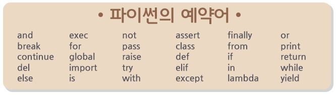

# Python 이란?

### 인터프리터 언어(Interpreter Language)


##### **대화 기능의 인터프리터 언어**

* 객체 지향 기능을 강력히 지원하는 대화형 인터프리터 언어
* 인터프리터 언어는 사용하기 쉬우며 컴파일하고, 실행해 보고, 에러를 고치는 기존의 절차에서 벗어나 작성한 다음 바로 테스트 가능한 간단한 언어이다.

###### **동적인 데이터 타입 결정 지원**

* 파이썬은 동적으로 데이터 타입을 경정하므로 데이터 타입에 관계없는 일반화된 코드를 작성할 수 있다.

###### **플랫폼 독립적 언어**

* Linux, Unix, Window, Dos, etc 대부분의 운영체제에서 동작한다. 
* 플랫폼에 독립적이며 컴파일하지 않고도 동작하기 때문에 사용하기 쉽다.
* Java와 같이 Python Byte Code를 생성하므로 소스 코드 없이도 다른 컴퓨터에서 즉시 수행된다.

###### **메모리 자동관리**

* 파이썬은 Garbage Collection(쓰레기 수집) 기능을 사용하여 필요할 때 메모리를 자동 할당하고 사용이 끝났을 때 자동으로 해제한다. 

###### **높은 확장성**

* 파이썬은 일명 접착제 언어(Glue Language)라고도 한다. 다른 언어나 라이브러리에 쉽게 접근해 그들을 사용할 수 있기 때문이다. 가장 보편적인 언어인 C와는 결합이 잘된다. 
* 기존의 C 프로그램을 파이썬과 결합시킬 수 있으며 소스 없는 라이브러리도 랩퍼(Wrapper) 함수만 써 주면 파이썬에서 사용할 수 있다.
* Wrapper Function(랩퍼 함수) : 라이브러리 함수를 중간 호출해주는 간단한 인터페이스 함수

###### **간단하고 쉬운 문법**

* 일반적인 수학 기호나 다른 프로그래밍 언어에 약간의 지식이 있으면 쉽게 배울 수 있다.
* 객체지향 언어로서 파이썬은 재사용 가능한 코드를 쉽게 만들 수 있다.

###### 

--------


> #  Python 기초 문법 정리 
>
> > ### 1. 주석(Comment)
> >
> > * 프로그래밍에 있어 내용을 메모하는 목적으로 쓰인다. 
> > * 컴파일러와 인터프리터에 의해 일반적으로 무시되어 프로그램에 영향을 주지 않는다.
> > * 다중 줄을 한번에 주석 처리할때는 주석문 전체 드래그 후 ctrl + / 키를 사용한다. 
> >
> > >**※**  **주석 종류**
> > >
> > >1. **한줄 주석 : #(샵)**
> > >
> > >* 주로 사용하지 않는 코드를 주석처리할 때 사용한다.
> > >* 혹은 코드 옆에 간단한 설명을 덧붙일 때 사용한다.
> > >
> > >```python
> > >#print('hello world') #'hello world'를 출력한다.
> > >```
> > >
> > >2. **여러줄 주석 : '''(작은 따옴표 3개), """(큰 따옴표 3개)**
> > >
> > >* 주로 Docstring을 위해 사용한다
> > >
> > >* Docstring :  함수 혹은 클래스의 설명을 위해 작성
> > >
> > >  ```python
> > >  func.__doc__
> > >  ```
> > >
> > >* '''와 """중 시작과 끝을 일치시켜서 하나만 사용하면 된다.
> > >
> > >  ```python
> > >  ​```
> > >  더하기를 위한 함수
> > >  두 수를 더해서 
> > >  결과를 return함
> > >  ​```
> > >  def add(a,b):
> > >      return a+b
> > >  ```
> >
> > ### 2. 변수와 식별자(Variable and Identifiers)
> >
> > #### 변수
> >
> > * 할당 연산자(=)을 통해 값을 할당하게 된다.
> > * 변수에 할당된 값의 타입 확인
> >
> > ```python
> > type()
> > ```
> >
> > * 변수에 할당된 객체의 메모리 주소 확인
> >
> > ```python
> > id()
> > ```
> >
> > * 값 Swap
> >
> >   파이썬의 경우 이런식의 값 변경이 가능해 tmp와 같은 제 3의 변수를 선언하지 않아도 된다.
> >
> > ```python
> > a, b = 1, 2
> > a, b = b, a
> > ```
> >
> > #### 식별자
> >
> > * 알파벳(대소문자 구분), 숫자, _를 사용하여 만들 수 있따.
> >
> > * 첫 글자에 숫자는 사용 불가능하다.
> >
> > * 파이썬에서 사용하는 키워드는 변수명으로 사용 불가능 하다.
> >
> > 
> >
> > * 내장 함수나 모듈 등의 이름으로도 만들면 안된다.
> >
> > #### 3. 데이터 타입()
> >
> > ### Reference

https://jjinfotech.tistory.com/21

