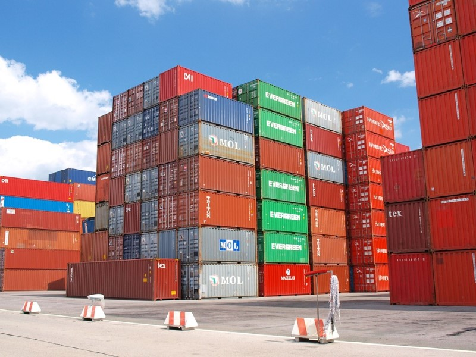

# Container 란?

### 컨테이너(Container)



##### **여러 개의 값을 저장할 수 있는 것**

* 시퀸스(Sequence)형 : 순서가 있는 (ordered) 데이터
* 비 시퀸스(Non-sequence)형 : 순서가 없는 (unoredered) 데이터 


--------


> #  Container의 종류  
>
> > ### 1. 시퀸스(Sequence)형 컨테이너 
> >
> > * **시퀸스**는 데이터가 순서대로 나열된(oredered) 형식을 나타낸다.
> > * _**주의!** 순서대로 나열된 것이 정렬되었다(sorted) 라는 뜻은 아니다._
> >
> > >1. **리스트(list)**
> > >
> > >* 리스트는 대괄호 [] 및 list() 를 통해 만들 수 있다.
> > >* 값에 대한 접근은 list[i]를 통해 한다.
> > >
> > >```python
> > >my_list = [1, 2, 3]
> > >another_list = list()
> > >```
> > >
> > >2. **튜플(tuple)**
> > >
> > >* 투플은 리스트와 유사하지만, () 로 묶어서 표현한다.
> > >* tuple은 수정 불가능(불변, immutable)하고, 읽을 수 밖에 없다.
> > >* 따라서 직접 사용하기 보다 파이썬 내부에서 다양한 용도로 활용하고 있다.
> > >
> > > ```python
> > > my_tuple = (1, 2)
> > > another_tuple = 1, 2
> > > ```
> > >
> > >* tuple 사용 예제  - 두 변수 swap
> > >
> > > ```python
> > > x, y = y, x
> > > print(x)
> > > print(y)
> > > ```
> > >
> > >* 빈 tuple과 요소의 갯수가 하나인 tuple 선언
> > >* 요소의 갯수가 하나인 tuple를 선언할 때는 반드시 뒤에 , 를 붙인다. 
> > >* 그렇지 않을시 선언한 요소의 type이 변수의 type으로 선언된다. 
> > >
> > >```python
> > >empty = ()
> > >single_tuple = (1,)
> > >```
> > >
> > >3. **레인지(range())**
> > >
> > >* range는 숫자의 시퀸스를 나타내기 위해 사용된다. 
> > >
> > >* 기본형 
> > >
> > >```python
> > ># 0부터 n-1 까지 값을 가짐
> > >range(n)
> > >```
> > >
> > >* 범위 지정
> > >
> > >```python
> > ># n부터 m-1 까지 값을 가짐
> > >range(n, m)
> > >```
> > >
> > >* 범위 및 스텝 지정 
> > >
> > >```python
> > ># n부터 m-1까지 +s만큼 증가한다
> > >range(n, m, s)
> > >```
> > >
> > >4. **시퀸스에서 활용할 수 있는 연산자/함수**
> > >
> > >|    operation |                    설명 |
> > >| -----------: | ----------------------: |
> > >|     x `in` s |        containment test |
> > >| x `not in` s |        containment test |
> > >|    s1 `+` s2 |           concatenation |
> > >|      s `*` n | n번만큼 반복하여 더하기 |
> > >|       `s[i]` |                indexing |
> > >|     `s[i:j]` |                 slicing |
> > >|   `s[i:j:k`] |       k간격으로 slicing |
> > >|       len(s) |                    길이 |
> > >|       min(s) |                  최솟값 |
> > >|       max(s) |                  최댓값 |
> > >|   s.count(x) |                x의 개수 |
> >
> > 
> >
> > ### 2. 비 시퀸스형(Non-sequence) 컨테이너 
> >
> > * 세트(set)
> > * 딕셔너리(dictionary)
> >
> > >1. **set**
> > >
> > >* set는 순서가 없고 중복된 값이 없는 자료구조이다.
> > >* set는 수학에서의 집합과 동일하게 처리 된다.
> > >* set는 중괄호 {} 를 통해 만들며, 순서가 없고 중복된 값이 없다.
> > >* 빈 세트를 만들려면 set()을 사용해야 한다. ({}로 사용 불가능)
> > >* 활용 가능한 연산자는 차집합( - ), 합집합( | ), 교집합( & ) 이다.
> > >
> > >```python
> > >set_a = {1, 2, 3}
> > >set_b = {3, 6, 9}
> > >```
> > >
> > >* 차집합
> > >
> > >```python
> > >set_a - set_b
> > >```
> > >
> > >* 합집합
> > >
> > >```python
> > >set_a | set_b
> > >```
> > >
> > >* 교집합
> > >
> > >```python
> > >set_a & set_b
> > >```
> > >
> > >* set는 중복된 값이 있을 수 없다.
> > >
> > >```python
> > >set_c = {1, 1, 1}
> > >set_d = {1}
> > >set_c == set_d # True
> > >```
> > >
> > >2. **Dictionary**
> > >
> > >* dictionary는 key와 value가 쌍으로 이루어져있다.
> > >* { }를 통해 만들며, dict()로 만들 수 있다.
> > >* key는 변경 불가능(immutable)한 데이터만 가능하다. (immutable: string, integer, float, boolean, tuple, range)
> > >* value는 list, dictionary를 포함한 모든 것이 가능하다. 
> > >* 선언법
> > >
> > >```python
> > >dict_a = {}
> > >dict_b = dict()
> > >```
> > >
> > >* dictionary에 중복된 key는 존재하지 않는다.
> >
> > 
> >
> > #### 3.  컨테이너형 형변환
> >
> > * 파이썬에서 컨테이너는 서로 형변환 할 수 있다. 
> >
> >   
> >
> >   
> >
> > #### 4. 데이터의 분류
> >
> > * mutable vs immutable
> > * 데이터는 크게 변경 가능한 것(mutable)들과 변경 불가능한 것(immutable)으로 나뉘며, python은 각각을 다르게 다룬다.
> >
> > >* 리터럴(literal)
> > >  - 숫자(Number)
> > >  - 글자(String)
> > >  - 참/거짓(Bool)
> > >* range()
> > >* tuple()
> > >* frozenset()
> >
> > * 이는 데이터를 참조할 때 큰 차이가 난다.
> >
> > ```python
> > # immutable
> > a = 5
> > b = a
> > b = 3
> > # a의 값은 변하지 않는다.
> > ```
> >
> > ```python
> > # mutable
> > a = [1, 2, 3]
> > b = a
> > b[0] = 5
> > # a의 list 값 역시 바뀐다 
> > ```
> >
> > 

---

### Reference

https://blog-rogan.tistory.com/entry/%ED%8C%8C%EC%9D%B4%EC%8D%AC-%EC%BB%A8%ED%85%8C%EC%9D%B4%EB%84%88-Container%EB%9E%80-%EB%A6%AC%EC%8A%A4%ED%8A%B8-List%EB%9E%80

