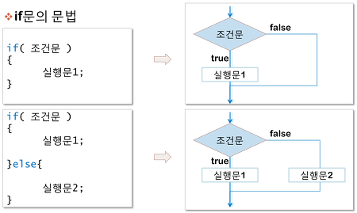

# Control Statement(제어문) 이란?

#####  코드 실행의 순차적인 흐름을 제어(Control Flow)

* **조건문**
* **반복문**



--------


> #  Control Statement(제어문)의 종류
>
> > ### 1. 조건문(Conditional Statement)
> >
> > * if 문은 반드시 **참/거짓을 판단할 수 있는 조건**과 함께 사용이 되어야 한다.
> >
> > >1. if 조건문의 구성
> > >
> > >* expression에는 일반적으로 참/거짓에 대한 조건식이 들어간다.
> > >* **조건**이 **참**인 경우 `:` 이후의 문장을 수행한다.
> > >* **조건**이 **거짓**인 경우 `else:` 이후의 문장을 수행한다.
> > >* 여러 개의 `elif` 부가 있을 수 있고(없거나), `else`는 선택적으로 사용한다.
> > >
> > >```python
> > >if <expression>:
> > >    <코드 블럭>
> > >else:
> > >    <코드 블럭>
> > >```
> > >
> > >* 이때 반드시 들여쓰기를 유의해야 한다.
> > >
> > >  - 파이썬에서는 코드 블록을 자바나 C언어의 `{}`와 달리 **들여쓰기**로 판단하기 때문입니다.
> > >
> > >  <center>
> > >      
> > >  </center>
> > >
> > >* **조건 표현식**(Conditional Expression)
> > >  	* 조건 표현식은 일반적으로 조건에 따라 값을 정할 때 활용된다.
> > >  	* **삼항 연산자(Ternary Operator)**라고 부르기도 한다.
> > >
> > >```python
> > >true_value if <조건식> else false_value
> > >```
> > >
> > >
> >
> > ### 2. 반복문(Loop Statement)
> >
> > * while
> > * for
> >
> > >1. **while** 반복문
> > >
> > >* `while` 문은 조건식이 참(`True`)인 경우 반복적으로 코드를 실행한다.
> > >* `while` 문 역시 조건식 뒤에 콜론(`:`)이 반드시 필요하며, 이후 실행될 코드 블럭은 **4spaces**로 **들여쓰기**를 한다.
> > >* **반드시 종료조건을 설정해야 한다.**
> > >
> > ><br>
> > >
> > ><center>
> > >    
> > ></center>
> > >
> > >```python
> > >while <조건식>:
> > >    <코드 블럭>
> > >```
> > >
> > >
> > >
> > >2. for 문
> > >
> > >* `for` 문은 시퀀스(string, tuple, list, range)를 포함한 순회가능한 객체(iterable)의 요소들을 순회한다.
> > >
> > >* `for` 문에서 요소 값에 다른 값을 할당해도 다음 반복구문에 영향을 주지 않는다.
> > >
> > >  다음 요소 값에 의해 덮어 씌워지기 때문이다.
> > >
> > >* 선언법
> > >
> > >```python
> > >for <임시변수> in <순회가능한데이터(iterable)>:
> > >    <코드 블럭>
> > >```
> > >
> >
> > 
> >
> > #### 3.  리스트(list) 순회에서 index의 활용하기
> >
> > >* `range()`와 순회할 list의 길이를 활용하여 index를 조작 가능합니다.
> > >
> > >  ```python
> > >  for i in range(4):
> > >      print(i)
> > >  ```
> > >
> >
> > 
> >
> > #### 4. enumerate()
> >
> > >* 인덱스(index)와 값(value)을 함께 활용 가능하다.
> > >* 데이터는 크게 변경 가능한 것(mutable)들과 변경 불가능한 것(immutable)으로 나뉘며, python은 각각을 다르게 다룬다.
> > >
> > >```python
> > ># enumerate()를 활용해서 출력해봅시다.
> > >lunch = ['짜장면', '초밥', '피자']
> > ># enumerate() 에 의해 반환되는 인덱스와 값(value)를 함께 출력하는 for 반복문을 작성해봅시다.
> > >for idx, menu in enumerate(lunch):
> > >    print(idx, menu)
> > >```
> >
> > 
> >
> > #### 5. 반복제어(`break`, `continue`, `for-else`)
> >
> > >* break
> > >  * `for` 나 `while` 문에서 빠져나간다.
> > >* continue
> > >  * `continue`문은 continue 이후의 코드를 수행하지 않고 *다음 요소부터 계속(continue)하여* 반복을 수행한다.
> > >* else
> > >  * 끝까지 반복문을 실행한 이후에 실행된다.
> > >  * 반복에서 리스트의 소진이나 (`for` 의 경우) 조건이 거짓이 돼서 (`while` 의 경우) 종료할 때 실행된다.
> > >  * 하지만 반복문이 **`break` 문으로 종료될 때는 실행되지 않는다.** (즉, `break`를 통해 중간에 종료되지 않은 경우만 실행)
> > >* pass
> > >  * 아무것도 하지 않는다. 
> > >  * 문법적으로 문장이 필요하지만, 프로그램이 특별히 할 일이 없을 때 자리를 채우는 용도로 사용할 수 있다.
> > >  * 뒤에 문장이 있을 경우 continue와 다르게 수행한다. 
> > >
> > >
> >

---

### Reference

https://codetorial.net/tips_and_examples/simple_if.html

