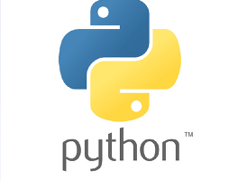

# OOP(Object Oriented Programming)

* 객체(Object)

* 객체지향프로그래밍(Object Oriented Programming)

* 클래스(Class)와 객체(Object)

  

> #  객체
>
> * Python에서 **모든 것은 객체(object)**입니다.
>
>   모든 객체는 **타입(type), 속성(attribute), 조작법(method)**을 가집니다.
>
>   - **타입(type)**: 어떤 연산자(operator)와 조작(method)이 가능한가?
>   - **속성(attribute)**: 어떤 상태(데이터)를 가지는가?
>   - **조작법(method)**: 어떤 행위(함수)를 할 수 있는가?
>
> > ### 1.1 타입(Type)과 인스턴스(Instance)
> >
> > |   type |                 instance |
> > | -----: | -----------------------: |
> > |  `int` |            `0`, `1`, `2` |
> > |  `str` | `''`, `'hello'`, `'123'` |
> > | `list` |       `[]`, `['a', 'b']` |
> > | `dict` | `{}`, `{'key': 'value'}` |
> >
> > > 1.1.1 **` 타입(Type)`**
> > >
> > > * 공통된 속성(attribute)과 조작법(method)을 가진 객체들의 분류
> > >
> > > 1.1.2 **`인스턴스(Instance)`**
> > >
> > > * 특정 타입(type)의 실제 데이터 예시(instance)입니다.
> > > * 파이썬에서 모든 것은 객체이고, **모든 객체는 특정 타입의 인스턴스**입니다.
> >
> > ## 1.2 속성(Attribute)과 메서드(Method)
> >
> > 객체의 속성(상태, 데이터)과 조작법(함수)을 명확히 구분해 봅시다.
> >
> > |      type |       attributes |                                methods |
> > | --------: | ---------------: | -------------------------------------: |
> > | `complex` | `.real`, `.imag` |                                        |
> > |     `str` |                _ | `.capitalize()`, `.join()`, `.split()` |
> > |    `list` |                _ |   `.append()`, `.reverse()`, `.sort()` |
> > |    `dict` |                _ |     `.keys()`, `.values()`, `.items()` |
> >
> > > 1.2.1 **`속성(Attribute)`**
> > >
> > > * 속성(attribute)은 객체(object)의 상태/데이터를 뜻합니다.
> > >
> > > * ```py
> > >   <객체>.<속성>
> > >   ```
> > >
> > > 1.2.2 **`메서드(Method)`**
> > >
> > > * 특정 객체에 적용할 수 있는 행위(behavior)를 뜻 합니다.
> > >
> > > * ```py
> > >   <객체>.<메서드>()
> > >   ```
> > >
>
> # 객체 지향 프로그래밍(Object-Oriented Programming)
>
> * Object가 중심(oriented)이 되는 프로그래밍
>
> > ### 2.1 값 추가 및 삭제
> >
> > >2.1.1 **`.append(x)`**
> > >
> > >* 리스트에 값을 추가할 수 있다.
> > >* 단, 모든 x는 리스트, dict 전부 타입 그대로 들어가게 된다.
> > >
> > >2.1.2 **`.extend(iterable)`**
> > >
> > >* 리스트에 iterable(list, range, tuple, string**[주의]**) 값을 붙일 수가 있습니다.
> > >* 단, 리스트 혹은 문자열은 모든 요소가 따로 들어가게 된다.
> > >
> > >2.1.3 **`.insert(i, x)`**
> > >
> > >* 정해진 위치 `i`에 값을 추가한다.
> > >
> > >2.1.5 **`.pop(i)`**
> > >
> > >* 정해진 위치 `i`에 있는 값을 삭제하며, 그 항목을 반환한다.
> > >* `i`가 지정되지 않으면 마지막 항목을 삭제하고 되돌려준다.
> > >
> > >2.1.6 **`.clear()`**
> > >
> > >* 리스트의 모든 항목을 삭제한다.
> >
> > ### 2.2 탐색 및 정렬
> >
> > >2.2.1**`.index(x)`**
> > >
> > >* x 값을 찾아 해당 index 값을 반환한다.
> > >
> > >2.2.2**`.count(x)`**
> > >
> > >* 원하는 값의 개수를 반환한다.
> > >
> > >2.2.3**`.sort()`**
> > >
> > >* 정렬을 한다.
> > >* 내장함수 `sorted()` 와는 다르게 **원본 list를 변형**시키고, **`None`**을 리턴한다.
> > >
> > >2.2.4**`.reverse()`**
> > >
> > >* 반대로 뒤집는다. **(정렬 아님)**.
> >
> > ### 2.3 리스트 복사
> >
> > > * 아래의 방법은 모두 얕은 복사(swallow copy이다.)
> > >   * **slice 연산자 사용 `[:]`**
> > >   * **`list()` 활용**
> > >   * **copy 모듈 활용**
> > >
> > > * 만일 중첩된 상황에서 복사를 하고 싶다면, `깊은 복사(deep copy)`를 해야합니다.
> > > * 즉, 내부에 있는 모든 객체까지 새롭게 값이 변경됩니다.
> >
> > ### 2.4 List comprehension
> >
> > * List Comprehension은 표현식과 제어문을 통해 리스트를 생성한다.
> > * 여러 줄의 코드를 한 줄로 줄일 수 있다.
> >
> > > 2.4.1 **활용법**
> > >
> > > ```python
> > > [expression for 변수 in iterable]
> > > 
> > > list(expression for 변수 in iterable)
> > > ```
> > >
> > > 
> > >
> > > 2.4.2 **List Comprehension + 조건문**
> > >
> > > * 조건문에 참인 식으로 리스트를 생성합니다.
> > >
> > > ```python
> > > [expression for 변수 in iterable if 조건식]
> > > ```
>
> 
>
> ## 데이터 구조에 적용 가능한 Buint-in-Function
>
> * 순회 가능한(iterable) 데이터 구조에 적용가능한 Built-in Function
> * iterable 타입 - `list`, `dict`, `set`, `str`, `bytes`, `tuple`, `range`
>   * `map()`
>   * `filter()`
>   * `zip()`
>
> >### 3.1 `map(function, iterable)`
> >
> >* 순회가능한 데이터 구조(iterable)의 모든 요소에 function을 적용한 후 그 결과를 돌려준다.
> >
> >- return은 `map_object` 형태이다.
> >
> >### 3.2 `filter(function, iterable)`
> >
> >* iterable에서 function의 반환된 결과가 `True` 인 것들만 구성하여 반환합니다.
> >
> >- `filter object` 를 반환합니다.
> >
> >### 3.3 `zip(*iterables)`
> >
> >* 복수의 iterable 객체를 모아(`zip()`)준다.
> >
> >- 결과는 튜플의 모음으로 구성된 `zip object` 를 반환한다.
> >
> >---

https://myjamong.tistory.com/274

